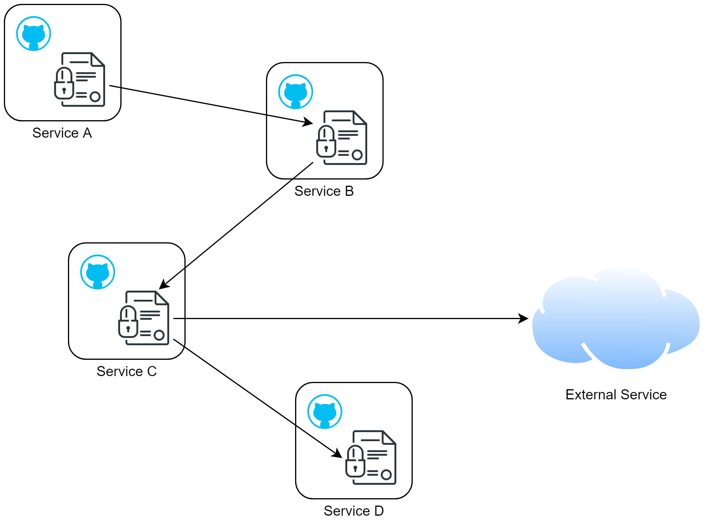

- [Contract Mesh: manageable microservices from the start](#contract-mesh-manageable-microservices-from-the-start)
  - [Components](#components)
    - [Service contracts](#service-contracts)
    - [Service catalog](#service-catalog)
    - [Contract validator](#contract-validator)
    - [Contract editor (nice to have)](#contract-editor-nice-to-have)
  - [Use cases](#use-cases)
    - [Developer portal](#developer-portal)
    - [Code generation](#code-generation)
    - [Create an environment from scratch](#create-an-environment-from-scratch)
    - [Configure the API gateway](#configure-the-api-gateway)
    - [Configure service mesh sidecars or resiliency behavior in code](#configure-service-mesh-sidecars-or-resiliency-behavior-in-code)
    - [Contract as a design document](#contract-as-a-design-document)

# Contract Mesh: manageable microservices from the start

The microservice pattern has many well-known benefits but also brings its own challenges. As the number of microservices increase in a company, the following manageability issues emerge:

- **Discoverability**: It's difficult for human actors to discover what services are available in the organization, what the capabilities of these services are, and the versions of each service that are historically available.
- **Documentation**: There's no centralized source of documentation for these services that can act as a developer portal; even if a portal existed, it often required manual updates.
- **Dependency management**: It's difficult to determine the dependencies of each service, and versions of these dependencies.
- **Deployment**: It's difficult to deploy an entire environment from scratch, each service having its own unique and complex deployment procedures, and the order in which services must be deployed is hard to determine.
- **Testing**: due to the lack of a dependency graph, it's difficult to deploy and test just a subset of services in a clean environment.

Many patterns have been invented to make microservices more manageable, such as service discovery, distributed tracing, API gateway, service mesh, etc. But by and large, these patterns address problems encountered *post-deployment*, at *runtime*.

The reality is, though, that the complexity of a microservice ecosystem has long started before anything is deployed, and that it's just as challenging to make sense of source code and artifacts of microservices as it is to manage deployed instances. No pattern currently exists to make the pre-deployment life cycle of microservices more manageable. Contract Mesh is intended to fill this void.

## Components

Contract Mesh consists of the following components:

### Service contracts



A service contract is a YAML document with a *standard format*, which declares the *features* offered by a service, as well as the *dependencies* that it has on other services and resources.

Contracts are declared in a *decentralized* manner by each service, but eventually aggregated by the [service catalog](#service-catalog) into a topology, or "mesh", of interdependent contracts. Hence the name of the pattern--Contract Mesh.

Each microservice's contract resides in a standard location in the service's source code repository. For example, `/contract/main.yaml`

The contract is authored by the developer, *prior* to writing service code.

Specifically, the document contains:

- **Features** that the service provides to the outside world, including:
  - Schemas of business entities owned by the service and referenced by REST API, events, and other features. Single-segment versioning is supported.
  - REST API specification, provided in the standard OpenAPI format. Single-segment versioning is supported.
  - Event specification, including topics and body schemas. Single-segment versioning is supported.
  - Metrics published by the service to a centralized telemetry platform
  - Log record schemas published by the service into a central logging platform
- **Dependencies** on other services. Each dependency specifies:
  - Required version range of the service
  - Specific abilities of the service that are utilized, such as REST API endpoints and events
  - Resiliency requirements for the dependency, such as the timeout, number of retries, circuit-breaker thresholds, etc.
- **Metadata** about the service, such as name, version, SCM tag, artifact location, etc. (The last three pieces of information can be filled by by the CI pipeline and shouldn't be specified by the author.)

A contract looks like the following:

```yaml
contractFormat: 1
info:
  category: dom
  name: orderService
  # BEGIN CI-provided fields
  version: 1.2.3.456
  source: http://github.acme.com/business/orders-service/tree/v1.2.3.456
  artifacts:
    docker: docker.acme.com/orders-service:v1.2.3.456
  # END CI-provided fields
features:
  entities:
    order:
      v1:
        required:
          - id
          - product-name
          - price
        properties:
          id:
            type: int,
            description: The unique identifier of this order
          productName:
            type: string,
            description: The name of the project being ordered
          price:
            type: float
            description: The price of this order
  apis:
    v1:
      openapi: 3.0.0
      paths:
        /orders/{orderId}:
          get:
            operationId: getOrderById
            x-api-gateway: true
            parameters:
              - name: orderId
                in: path
                schema:
                  type: integer
                  format: int64
            responses:
              200:
                content:
                  application/json
                    schema:
                      $ref: '#/features/entities/order/v1'
            security:
              - openId: [read-orders]
        /orders:
          post:
            operationId: postOrder
            requestBody:
              content:
                application/json
                  schema:
                    $ref: '#/features/entities/order/v1'
            responses:
              200:
                content:
                  application/json:
                    schema:
                      properties:
                        id:
                          type: int
            security:
              - openId: [write-orders]
      components:
        securitySchemes:
          openId:
            type: openIdConnect
            openIdConnectUrl: https://example.com/.well-known/openid-configuration
    v2: ...
  events:
    order.created
      v1:
        schema:
          $ref: '#/features/entities/order/v1'
  metrics:
    orderCount:
      type: counter
      dimensions:
        - state
        - result
      resolution: 10s
  logRecords:
    orderFailed:
      schema:
        productName:
          type: string
        userName:
          type: string
dependencies:
  productService:
    version: 1.3
    apis:
      getProductById:
        resiliency:
          timeout: 10s
          retries: 3
          circuitBreaker:
            threshold: 10
    events:
      product.updated: ~
  pricingService: ...
```

### Service catalog


The service catalog is a microservice that aggregates all contracts from all services available in an organization.

The catalog is populated by continuous integration. Whenever a service is built, the CI pipeline publishes the service's contract into the service catalog.

The catalog supports multiple versions of the same contract. When CI publishes a contract to the catalog, it assigns the same version to the contract as the associated artifacts.

The catalog supports querying services in flexible ways, including:

- Returns a complete dependency graph of all available microservices, as wells the available versions of each service
- Given a service of a particular vesion, return a subset of dependency graph of the service and all of its direct and indirect dependencies
- Return a subset of a contract, such as only the REST API

The catalog itself comes with a service contract.

### Contract validator

The contract validator is a CLI application that calls the service catalog to validate the correctness of the contract. The validator could be run by developers manually when authoring the contract. It could also be invoked by the CI pipeline prior to publishing. The validator ensures that:

- The contract syntax is correct, and required information is provided
- Breaking changes to the contract are not made without versioning
- Dependencies are correctly named and actually exist in the service catalog
- No circular depedencies are formed
- The contract conforms to company standards

### Contract editor (nice to have)

The contract editor is a GUI application that makes it easy to write correct contracts. Alternatively, the contract can be written with any text editor with the help of the validator.

## Use cases

The Contract Mesh is a concept that kills many birds with one stone. It enables many powerful possibilities. They include:

### Developer portal

The Service Catalog provides complete metadata on all available services, such as REST APIs, event schemas, log records, and metrics. A Developer portal can be written that exposes this information in an highly human-readable format. Such a portal would need significantly less manual maintenance.

### Code generation

The contract can be used to automatically generate server-side code that implements the REST APIs, event schemas, log records, and metrics described in the contract. A reusable services framework can help ensure that the contract is strictly obeyed by code.

Using the dependencies described in the contract, and by querying the service catalog for details about the dependencies, *client-side* code can also be generated that calls other services' APIs and consume other services' events. The services framework can ensure that the service only interacts with those services referenced in the contract.

The client interface created by codegen can transparently obtain and cache access tokens. Codegen can read the security specification in the API specification of a referenced service to discover its authentication scheme, and call the identity server to obtain a token with the scopes required by an API endpoint.

### Create an environment from scratch

The contract mesh fully describe the dependencies between services and this allows us to easily create an environment from scratch. It's possible to both deploy the entire microservice ecosystem, or a subset of services.

Fixed testing environments will be a thing of the past. Instead of dedicated DEV, QA, INT environments that are constantly running, the contract mesh allows us to create a test environment for the duration of a test run, containly only those services that are of interest to the test, and once we are done, easily tear it down. These environments can be used for both manual testing and automated testing.

### Configure the API gateway

API gateways is an essential part of any microservice architecture. However, the gateway's configuration is usually separate from the deployment of services, thus adding to deployment complexity.

The service contract is a natural location for API gateway configuration. By adding a custom field to the OpenAPI document such as `x-api-gateway`, the contract author can decide which endpoints to expose to the gateway:

```yaml
...
/orders/{orderId}:
  get:
    operationId: getOrderById
    x-api-gateway: true
...
```

When the service is deployed to an environment, the API gateway in that environment can retrieve its contract. It can then look for those endpoints with gateway exposure enabled, and configure itself accordingly.

### Configure service mesh sidecars or resiliency behavior in code

Sidecars are a definitive feature of a service mesh that provides invocation resiliency between services. Just like the API Gateway, naive implementations of service mesh requires it to be configured separately from services themselves, adding to deployment complexity and management challenges.

The service contract is a natural location for sidecar configuration. During deployment, when the service is being deployed, the deployment pipeline can query the service's contract and configure the sidecar accordingly:

```yaml
...
dependencies:
  productService:
    version: 1.3
    apis:
      getProductById:
        resiliency:
          timeout: 10s
          retries: 3
          circuitBreaker:
            threshold: 10
...
```

The resiliency specification is not specific to any resiliency product. If a service mesh is not used, the specification can still be used by the code generator to add resiliency behavior in client-side code using such libraries as resiliency4j and Polly.

### Contract as a design document

The contract, produced before any code is written, can serve as a design document. Its high-level nature makes it easy to read and understand.

Once the design is approved, it does not need to be translated to any other format for implementation; it can be immediately included in the source control repository.

Since the contract is also used to generate code and configure infrastructure, it *must* be kept up to date, which is a significant benefit to its role as a design document.
